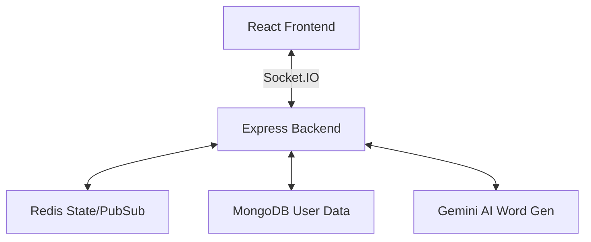

# Gemini Project Context: InkArena

InkArena is a real-time multiplayer drawing and guessing game where players compete to draw words and guess them as quickly as possible. The project follows a client-server architecture using WebSockets for real-time synchronization and Redis for distributed state management.

## Project Overview

- **Purpose:** Multiplayer drawing and guessing game with real-time stroke synchronization, scoring, and lobby management.
- **Key Features:**
  - Real-time batched stroke transmission.
  - Room-based lobbies with host controls.
  - Turn-based round logic with automated word selection (including optional Gemini AI integration).
  - Time-based scoring and close-guess detection (Levenshtein distance).
  - Distributed state persistence using Redis and Lua scripts for atomicity.
  - Authentication via Clerk.

## Architecture

- **Frontend:** React SPA built with Vite, utilizing Zustand for state management and Tailwind CSS for styling.
- **Backend:** Node.js Express server with Socket.IO. Handles game logic, round lifecycles, and scoring.
- **State Layer:** Redis is the primary store for active room data, stroke history, and distributed locks. MongoDB is used for persistent user data.

## Tech Stack

### Frontend
- **Framework:** React 18 (TypeScript)
- **Build Tool:** Vite 5
- **Styling:** Tailwind CSS 3.4, shadcn/ui
- **State Management:** Zustand 5
- **Real-time:** Socket.IO Client 4.8
- **Animations:** Framer Motion 12
- **Auth:** Clerk

### Backend
- **Framework:** Express 4.18
- **Real-time:** Socket.IO 4.6
- **Database:** MongoDB (Mongoose), Redis (node-redis)
- **Adapter:** `@socket.io/redis-adapter` for horizontal scaling
- **Auth:** Clerk (@clerk/express)
- **AI:** Google Gemini API (optional)

## Development Workflow

### Project Structure
- `Backend/`: Server-side logic, socket handlers, and Redis integration.
  - `src/server.js`: Entry point.
  - `src/sockets/`: Socket event handlers.
  - `src/game/`: Core game engine and scoring logic.
  - `src/redis/`: Redis client and room store (Lua scripts).
- `Frontend/`: React application.
  - `src/store/gameStore.ts`: Central game state.
  - `src/hooks/useGameSocket.ts`: Main socket event listener mapping server events to Zustand actions.
  - `src/components/DrawingCanvas.tsx`: Canvas rendering and stroke broadcasting.

### Key Commands

#### Backend
- `npm run dev`: Start server with file watching.
- `npm start`: Start production server.

#### Frontend
- `npm run dev`: Start Vite development server.
- `npm run build`: Build for production.
- `npm run test`: Run unit tests (Vitest).
- `npm run lint`: Run ESLint.

### Coding Conventions
- **Socket Events:** Use descriptive event names (e.g., `draw_stroke_batch`, `round_started`). Prefer batched events for high-frequency data.
- **State Management:** Keep the frontend state in Zustand and the backend state in Redis. Avoid local component state for game-critical data.
- **Atomic Operations:** Use Redis Lua scripts in `roomStore.js` for room creation and state transitions to prevent race conditions.
- **Types:** Shared types should be maintained in `Frontend/src/types/socket.ts` and ideally synced with backend expectations.

## Environment Variables

### Backend (`Backend/.env`)
- `PORT`: Server port (default 3000).
- `REDIS_URL`: Redis connection string.
- `GEMINI_API_KEY`: API key for AI word generation.
- `ALLOWED_ORIGIN`: CORS origin for frontend.

### Frontend (`Frontend/.env`)
- `VITE_BACKEND_URL`: Backend server URL.
- `VITE_CLERK_PUBLISHABLE_KEY`: Clerk public key.
